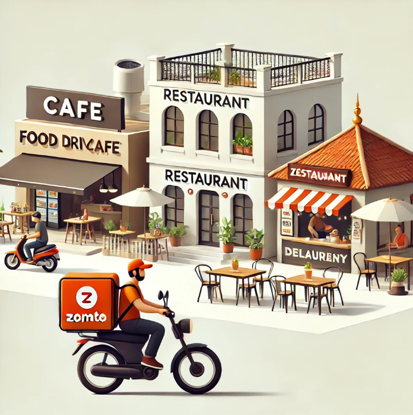

# Zomato-Dataset-EDA

Inspired by my love for food and excitement for looking for new food outlets to hit up, led me to explore this dataset containing info of Bangalore restaurants from Zomato. 

Link to the dataset: https://www.kaggle.com/datasets/himanshupoddar/zomato-bangalore-restaurants

Through exploratory data analysis, I identified high-density locations to avoid for future restaurant openings and pinpointed less crowded areas with significant potential for growth.

Restaurants offering online ordering facilities tend to have higher maximum ratings, with an average peak of 4.8, compared to those without, which top out around 4.2. Conversely, establishments with table booking options generally report higher average ratings.

I assessed various metrics to identify optimal locations for new restaurant ventures, focusing on areas with lower congestion to maximize business potential.

My study also encompassed diverse restaurant categories such as buffets, cafes, delivery services, dessert spots, dine-outs, and nightlife venues. Notably, drinks and nightlife establishments achieved the highest ratings.
